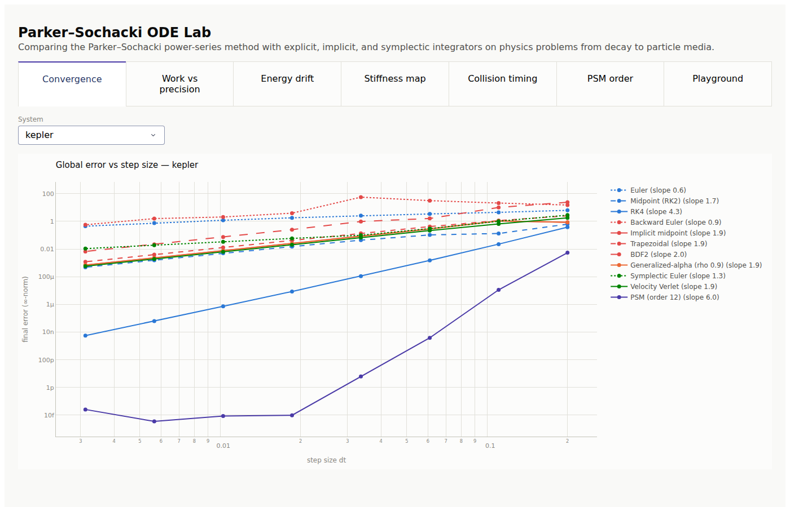
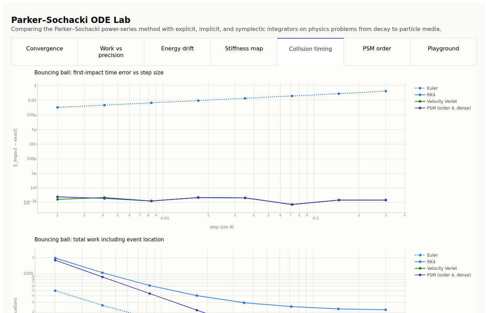

# psim: a Parker-Sochacki physics simulation lab

A research codebase for one question: **where does the Parker-Sochacki method
(PSM) genuinely beat classical ODE integrators in physics simulation, and where
does it not?** The method was developed by G. Edgar Parker and James Sochacki
in the JMU Mathematics department, which makes this a fitting home project for
a Duke.

The package compares PSM against explicit (Euler, RK2, RK4, adaptive RKF45),
implicit one-step (backward Euler, implicit midpoint, trapezoidal), implicit
multistep (BDF2), structural-dynamics (generalized-alpha with a tunable
high-frequency dissipation parameter), and symplectic (semi-implicit Euler,
velocity Verlet) integrators on a ladder of systems from "hello world" ODEs up
to particle media, and ships a Dash app to explore every result interactively.

## Quickstart

```bash
cd physics
pip install -e .            # numpy, pandas, plotly, dash
python -m pytest tests      # 33 tests, ~6 s
python -m psim.viz.dash_app # results explorer at http://127.0.0.1:8050
```

Minimal API example:

```python
from psim.systems import Kepler
from psim.integrators import ParkerSochacki, RungeKutta4, simulate

system = Kepler(eccentricity=0.6)
run = simulate(system, ParkerSochacki(order=20, tol=1e-12), t_end=6.28, dt=0.785)
print(run.y_final, run.rhs_evaluations, run.events)
```

## The experiment ladder

| Rung | System | Registry name | Why it is here |
|---|---|---|---|
| 1 | Exponential decay | `decay` | Exact solution; the linear stability test |
| 2 | Damped oscillator | `oscillator` | Stiffness and damping knobs; exact solution |
| 3 | Stiff spring-damper | `stiff-spring` | k = 1e4: the explicit-vs-implicit divide |
| 4 | Nonlinear pendulum | `pendulum` | First nonlinear rung; sin/cos polynomial lifting |
| 5 | Kepler two-body | `kepler` | Rigid-body-style orbital dynamics; 1/r^3 lifting; two invariants; closed-form solution |
| 6 | Mass-spring chain | `mass-spring-chain` | Many coupled modes; the 1-D soft body |
| 7 | Bouncing ball | `bouncing-ball` | Collision events; exact impact time |
| 8 | Granular box | `granular-box` | Soft-sphere DEM sand; piecewise contact forces |
| 9 | SPH fluid | `sph-fluid` | 2-D weakly compressible dam break |
| 10 | Free rigid body | `rigid-body` | Quaternion + Euler equations; Dzhanibekov tumbling; identity PSM lifting |

For every equation, integrator update rule, lifting recurrence, and the
collision math written out for re-implementation, see
[`docs/METHODS.md`](docs/METHODS.md). For the paper's prior-art position,
see [`docs/novelty_review.md`](docs/novelty_review.md).

Rungs 1 through 7 have polynomial liftings and run under PSM. Rungs 8 and 9
deliberately do not: compact-support kernels and contact switching break the
analyticity PSM needs, which is itself one of the findings (see below).

## How PSM works, in one paragraph

Rewrite the ODE so its right-hand side is polynomial, adjoining auxiliary
variables where needed (`s = sin(theta), c = cos(theta)` for the pendulum;
`u = 1/r^3, w = 1/r^2` for gravity). For a polynomial system, Picard iteration
stops being a proof device and becomes an algorithm: the k-th Maclaurin
coefficient of the solution follows from coefficients 0..k-1 using only Cauchy
products, in `C[k+1] = P_k(C[0..k]) / (k+1)`. One step of PSM builds the first
K coefficients of the local Taylor series and evaluates the polynomial at dt.
The truncation order K is a runtime parameter, and the step produces not just
an endpoint but an entire local polynomial solution.

## Findings against the research questions

All numbers below are reproduced by the test suite and the benchmark modules
(`psim.experiments.benchmarks`); the Dash app plots them.

### Time steps

On one full period of the e = 0.6 Kepler orbit, PSM at order 20 with its
native tolerance control takes steps of order pi/4, finishes with final-state
error 1.6e-13 using about 640 coefficient recurrences. RK4 needs dt = 0.001
(6,283 steps, 25,132 RHS evaluations) to reach error 1.2e-3. That is ten
orders of magnitude more accurate for roughly 40x less work. The convergence
tab shows the same story as slopes: each classical method converges at its
fixed textbook order, while PSM's effective order is whatever you set.



### Conserving energy

Three different mechanisms, and the study separates them cleanly:

* **Symplectic methods** (Verlet, symplectic Euler, implicit midpoint) do not
  shrink the energy error; they **bound** it. Verlet on the pendulum at
  dt = 0.01 oscillates around a 2e-4 relative drift forever, while forward
  Euler's drift grows without bound on the same grid.
* **Implicit midpoint** conserves quadratic invariants exactly (harmonic
  oscillator energy to Newton tolerance at any dt), a special-case superpower.
* **PSM conserves energy by brute accuracy**: it is not symplectic, but at
  order 20 the per-step error sits at roundoff, so energy and angular momentum
  drift stay near 1e-13 over the benchmark horizons. On very long horizons at
  loose tolerance a symplectic method will eventually win on drift per work;
  at tight tolerance PSM's error is already at the noise floor.

### Parameter flexibility: stiffness and damping

The stability map (oscillator, stiffness swept 1 to 1e4) draws the textbook
boundary dt ~ 1/sqrt(k) for every explicit method, PSM included: raising the
order widens the stable region only by a constant factor. The implicit family
is stable everywhere in the map and limited only by accuracy. The damping
sweep shows the same divide as c grows through overdamped (stiff) territory.

Within the implicit family the suite now separates three damping behaviors,
which is its own parameter-flexibility axis:

* **Trapezoidal** has no numerical damping at all: on an unresolved stiff
  transient its iterates ring (amplification factor near -1) with amplitude
  stuck near 1.
* **BDF2** is L-stable: same second order, but it annihilates the unresolved
  transient within a few steps, which is why production stiff solvers build
  on it.
* **Generalized-alpha** makes the damping a dial. Its spectral radius
  parameter rho_inf in [0, 1] selects how hard *unresolvable* high-frequency
  modes are damped while the resolved band keeps second-order accuracy:
  at dt = 0.05 it annihilates a k = 1e4 oscillation (period 0.063) to below
  1e-3 of its energy in the same run where a resolved pendulum swing keeps
  its energy to a few permille. That frequency-selective dissipation is
  exactly what stiff chains, hard contacts, and noisy SPH pressure fields
  want, and no other family in the suite offers it.
This is PSM's clearest non-novelty: **it is an explicit method with an
explicit method's stiffness limits.** The series sees the fast transient and
its native step control shrinks h to resolve it, even when the transient is
long dead. For hard contacts (stiff sand) and very viscous or stiff-EOS
fluids, implicit or semi-implicit methods keep the advantage.

### Collision detection and response

This is PSM's most under-appreciated novelty. A PSM step returns a local
polynomial, so an event guard becomes a root-find on a known polynomial: no
extra integration, no interpolation error beyond roundoff. The bouncing-ball
study measures first-impact timing error across step sizes:

* PSM (order 4): error flat at about 1e-16 for every dt tested, including
  dt = 0.3, with zero extra RHS work for event location.
* Euler with bisection re-stepping: error grows to about 1e-1 at coarse dt
  (and at the coarsest step it misses the impact inside the horizon entirely),
  with the bisection probes showing up as extra work.



RK4's located impact happens to be exact here because free flight is a cubic
polynomial problem, but it pays for the location with dozens of re-integration
probes per event, and on a nonlinear system its located time inherits the
method's local error. The general statement: **any dense-output method can do
event location, but PSM's dense output is the exact local solution and it is
free.**

### Where PSM is genuinely novel

1. **Order as a runtime knob.** No tableau rederivation; K = 30 is a
   constructor argument. Error falls geometrically with K at fixed dt (PSM
   order tab) while work grows only linearly in K per step (quadratically in
   the Cauchy products at high K).
2. **Free, exact-to-truncation dense output**, hence the collision result, and
   cheap high-quality interpolation for rendering at arbitrary frame times
   (evaluate the polynomial at the frame time; no re-simulation).
3. **Principled adaptivity from data already computed.** The tail coefficients
   estimate the local radius of convergence; `h = (tol/|C_K|)^(1/K)` is a
   step controller with no embedded second method and no extra evaluations.
4. **The lifting discipline itself.** Rewriting a model in polynomial form is
   a modeling act; once done, you get machine-precision local solutions of the
   true nonlinear system, not a linearization.

### Where PSM is not the right tool

* Stiff dynamics (hard contacts, high damping, stiff equations of state).
* Non-analytic right-hand sides: contact switching, Coulomb friction, SPH
  kernels with compact support. Every such switch is a series-killing event;
  with many particles the events are dense in time and PSM degenerates to
  event-hunting. The granular and SPH rungs exist to make this concrete.
* Situations where per-step cost matters more than accuracy (real-time games):
  symplectic Euler's single force evaluation per frame is hard to beat.

## Production notes

* `psim.core.decorators` provides `timed`, `counted`, `registry`, `memoized`;
  systems and integrators self-register, so the benchmark suite and the Dash
  app enumerate them without import-order tricks.
* Work accounting: for classical methods, work = RHS evaluations. For PSM the
  meter counts coefficient recurrences, the closest per-unit analogue. A
  recurrence at high order costs more than an RHS call (Cauchy products), so
  wall-clock time is also recorded on every trajectory; on these benchmarks
  the work-unit and wall-clock rankings agree.
* Every state-advancing object is typed, docstringed, and tested (33 tests:
  convergence orders, invariant behavior, event timing, exporter round-trips).

## Python to Houdini/Unreal: thoughts on the iteration loop

The experiment you describe (iterate in Python, visualize in a DCC) is the
right architecture, and `psim.export` implements the handoff:

* `export_particle_frames(run, system, out_dir)` writes per-frame CSV point
  clouds plus a `manifest.json`. Houdini ingests these with a Table Import
  SOP or three lines in a Python SOP; Unreal's Niagara CSV importer consumes
  the same files for point-cache emission.
* `export_npz(run, system, path)` round-trips the whole trajectory as NumPy
  arrays, which Houdini's bundled Python also reads directly.

Recommended loop: keep the solver headless and deterministic (seeded, fixed
dt), iterate physics in pytest plus the Dash app where a run is seconds, and
only ship frames to Houdini when the dynamics are right. Houdini is the
better first DCC target for this project: its geometry model is point
attributes, exactly what the exporter emits, and you can regress against its
own Vellum/POP solvers on the same scene. Unreal is the better second target
once you want interactivity, but its physics iteration loop is slower to
rebuild. A practical PSM-specific trick: because each step is a polynomial,
you can resample any simulation to exact 24 or 30 fps frame times without
re-running it, so simulation dt and render cadence decouple completely.

## Repository layout

```
physics/
  src/psim/
    core/          types, decorators
    systems/       the nine systems, polynomial liftings, series algebra
    integrators/   explicit, implicit, symplectic, Parker-Sochacki, driver
    experiments/   metrics, sweep runner, canned benchmark studies
    viz/           plotly theme + Dash app (python -m psim.viz.dash_app)
    export/        CSV/NPZ frame exporters for Houdini and Unreal
  tests/           pytest suite
  docs/            screenshots used above
```

## Roadmap

* Rigid bodies with rotation (quaternion state has a clean polynomial lifting;
  SO(3) is where PSM vs Lie-group integrators gets interesting).
* Adaptive-order PSM (grow K per step until the tail passes tolerance).
* Neighbor grids for the particle systems, then larger sand/fluid scenes.
* A hybrid stepper: PSM for smooth flight, implicit for contact manifolds.
* A Houdini HDA that watches an export directory and hot-reloads frames.

## References

* Parker, G. E. and Sochacki, J. S., "Implementing the Picard iteration",
  Neural, Parallel and Scientific Computations 4 (1996).
* Pruett, C. D., Rudmin, J. W. and Lacy, J. M., "An adaptive N-body algorithm
  of optimal order", Journal of Computational Physics 187 (2003).
* Sochacki, J. S., "Polynomial ODEs: examples, solutions, properties",
  Neural, Parallel and Scientific Computations 25 (2017).
* Hairer, Lubich, Wanner, "Geometric Numerical Integration" (symplectic
  background), Springer.
