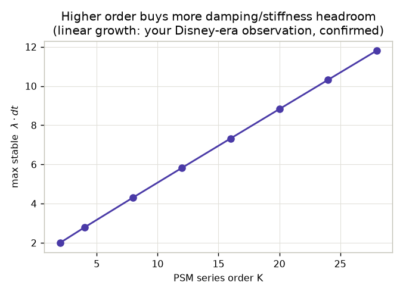
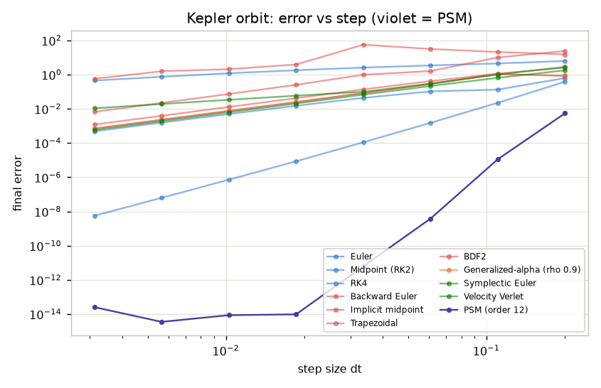
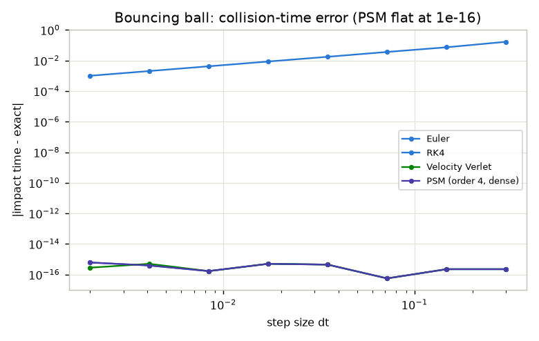
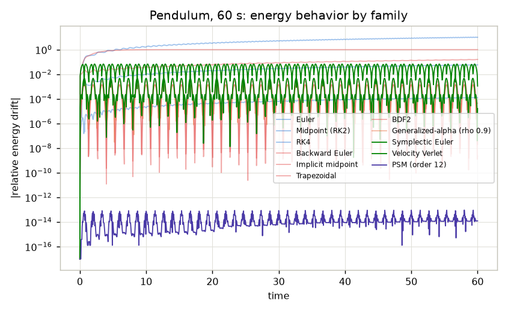
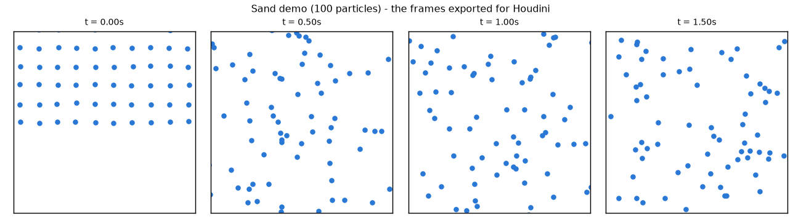

# Findings so far (one page)

## 1. Your damping/stiffness result was right

Max stable step grows linearly with PSM order. At order 2 PSM tolerates the
same damping as explicit Euler; at order 28 it tolerates 6x more. What you
saw in your experiments was this line.

The catch: cost per step grows quadratically with order, so implicit methods
still win at extreme stiffness. Both statements are true at once.

## 2. Accuracy per step: PSM dominates on smooth motion

One Kepler orbit: PSM order 12 is 8-10 orders of magnitude more accurate
than everything else at the same step size.

## 3. Collision timing: the strongest result

PSM finds the impact time to 1e-16 at every step size, because the step is a
polynomial and the impact is a root of it. Euler's error grows to 0.1 and it
misses the impact entirely at the coarsest step.

## 4. Energy

Symplectic methods bound the drift; PSM sits at the roundoff floor; plain
explicit methods drift away.

## 5. Houdini

`exports/sand_demo/` contains 73 CSV frames (100 particles, 48 fps) plus
`manifest.json` and `sand.npz`. In Houdini: Geometry node -> Table Import
SOP -> point to `frame_$F4.csv`, map columns px py pz to P. Stills of what
you will see:

